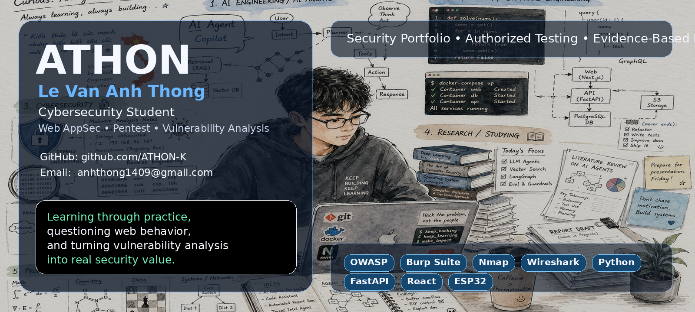
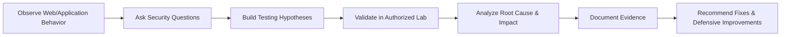
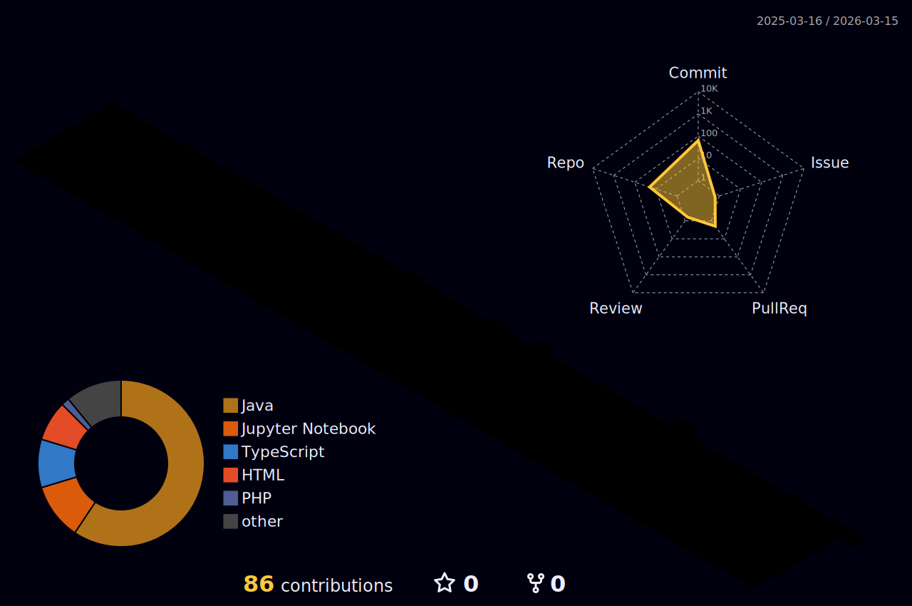

# Le Van Anh Thong — ATHON

### Cybersecurity Student | Web Application Security | Vulnerability Analysis | Penetration Testing

**Learning through practice, questioning web behavior, and turning vulnerability analysis into real security value.**

 

---

## About Me

I am **Le Van Anh Thong**, a cybersecurity student building practical skills in **web application security**, **vulnerability analysis**, **penetration testing**, **network security**, and **security automation**.

My learning style is based on a clear technical workflow: observe application behavior, form hypotheses, validate them through authorized testing, analyze root causes, document evidence, and translate findings into practical remediation value.

I focus on projects that connect theory with hands-on practice, including web security testing, network infrastructure design, wireless/IoT security, blockchain voting systems, credential-storage research, and multi-agent reconnaissance automation.

---

## Security Focus

| Area | What I Practice |
|---|---|
| **Web Application Security** | Authentication, authorization, input validation, business logic, session/JWT flow, OWASP-style testing |
| **Vulnerability Analysis** | Reproduction, impact assessment, root-cause analysis, remediation explanation |
| **Penetration Testing** | Reconnaissance, mapping attack surface, controlled exploitation, evidence-based reporting |
| **Network Security** | Enterprise network design, segmentation, firewall thinking, monitoring and defensive architecture |
| **IoT & Wireless Security** | ESP32-based lab work, Wi-Fi behavior, wireless security awareness, controlled testing |
| **Security Automation** | Python tooling, FastAPI backends, agent-based reconnaissance, structured report generation |

---

## Technical Methodology

I do not only aim to confirm that a vulnerability exists. I aim to understand **why it happens**, **how it can be reproduced safely**, **what impact it creates**, and **how it can be mitigated**.

---

## Tools & Stack

### Security & Analysis

### Development & Automation

---

## Featured Projects

<table>
  <tr>
    <td width="50%">
      <h3><a href="https://github.com/ATHON-K/MINA">MINA — Multi-Intelligence Network Agent</a></h3>
      

        A security automation project for authorized reconnaissance, attack-surface mapping,
        evidence collection, and structured reporting.
      

      
<b>Focus:</b> Python, FastAPI, React, LangGraph, recon workflow, report generation.

    </td>
    <td width="50%">
      <h3><a href="https://github.com/ATHON-K/Web-Sec-Project">Web-Sec-Project</a></h3>
      

        A web security/e-commerce project for practicing authentication, authorization,
        secure backend design, payment flow, admin features, and application security thinking.
      

      
<b>Focus:</b> Java, Spring Boot, Spring Security, JWT, MySQL, web application security.

    </td>
  </tr>
  <tr>
    <td width="50%">
      <h3><a href="https://github.com/ATHON-K/Toy-Store-Web">Toy-Store-Web</a></h3>
      

        A Java-based web application project that supports practical learning around web backend,
        user flow, data handling, and secure application development.
      

      
<b>Focus:</b> Java, web application, backend logic, security-aware development.

    </td>
    <td width="50%">
      <h3><a href="https://github.com/ATHON-K/Network-Infrastructure-Design-Project">Network Infrastructure Design Project</a></h3>
      

        A network design project focused on enterprise infrastructure planning, segmentation,
        routing/switching concepts, and security-oriented network architecture.
      

      
<b>Focus:</b> Network design, infrastructure security, segmentation, documentation.

    </td>
  </tr>
  <tr>
    <td width="50%">
      <h3><a href="https://github.com/ATHON-K/Extract-Firefox-Passwords">Extract Firefox Passwords</a></h3>
      

        A controlled educational project for understanding how browser credential storage works,
        including Firefox profile data, password storage concepts, and ethical handling of sensitive data.
      

      
<b>Focus:</b> Python, browser security, credential storage, defensive understanding.

    </td>
    <td width="50%">
      <h3><a href="https://github.com/ATHON-K/GSM_BASED_INDUSTRY_PROTECTION_SYSTEM">GSM Based Industry Protection System</a></h3>
      

        An ESP32/GSM-based industrial protection system integrating sensors, alerts, LCD display,
        relay control, and emergency response logic.
      

      
<b>Focus:</b> C, ESP32, GSM, sensors, embedded systems, IoT security awareness.

    </td>
  </tr>
</table>

---

## Repository Index

| Repository | Main Direction | Link |
|---|---|---|
| **ATHON** | GitHub profile / personal portfolio | [github.com/ATHON-K/ATHON](https://github.com/ATHON-K/ATHON) |
| **MINA** | Multi-agent security reconnaissance and reporting | [github.com/ATHON-K/MINA](https://github.com/ATHON-K/MINA) |
| **Web-Sec-Project** | Web security / e-commerce application | [github.com/ATHON-K/Web-Sec-Project](https://github.com/ATHON-K/Web-Sec-Project) |
| **Toy-Store-Web** | Java web application project | [github.com/ATHON-K/Toy-Store-Web](https://github.com/ATHON-K/Toy-Store-Web) |
| **Network-Infrastructure-Design-Project** | Enterprise network infrastructure design | [github.com/ATHON-K/Network-Infrastructure-Design-Project](https://github.com/ATHON-K/Network-Infrastructure-Design-Project) |
| **Smart-Voting-Blockchain** | Blockchain voting DApp | [github.com/ATHON-K/Smart-Voting-Blockchain](https://github.com/ATHON-K/Smart-Voting-Blockchain) |
| **Extract-Firefox-Passwords** | Browser credential-storage research | [github.com/ATHON-K/Extract-Firefox-Passwords](https://github.com/ATHON-K/Extract-Firefox-Passwords) |
| **GSM_BASED_INDUSTRY_PROTECTION_SYSTEM** | ESP32/GSM industrial protection system | [github.com/ATHON-K/GSM_BASED_INDUSTRY_PROTECTION_SYSTEM](https://github.com/ATHON-K/GSM_BASED_INDUSTRY_PROTECTION_SYSTEM) |
| **Gaming_Gear_App** | Application development / product app | [github.com/ATHON-K/Gaming_Gear_App](https://github.com/ATHON-K/Gaming_Gear_App) |
| **Thong** | Earlier repository / archive | [github.com/ATHON-K/Thong](https://github.com/ATHON-K/Thong) |

---

## Current Learning Path

- Web Application Pentesting
- OWASP Top 10 testing methodology
- Vulnerability reproduction and validation
- Secure backend development with authentication and authorization
- Network and infrastructure security design
- Wireless/IoT security fundamentals
- Malware behavior analysis and reverse engineering basics
- Security automation and AI-assisted reporting
- Professional security report writing

---

## Security Lab Mindset

I build and test only in **authorized**, **controlled**, and **educational** environments. My goal is to strengthen defensive understanding by combining:

- Clear testing scope
- Reproducible methodology
- Evidence-based validation
- Responsible vulnerability analysis
- Practical remediation guidance
- Professional documentation

> Security work is valuable when it helps people understand risk, fix weaknesses, and build safer systems.

---

## GitHub Activity

---

## Contact

- **GitHub:** [github.com/ATHON-K](https://github.com/ATHON-K)
- **Email:** [anhthong1409@gmail.com](mailto:anhthong1409@gmail.com)

---

**ATHON — learning, testing, analyzing, and improving security through practice.**

